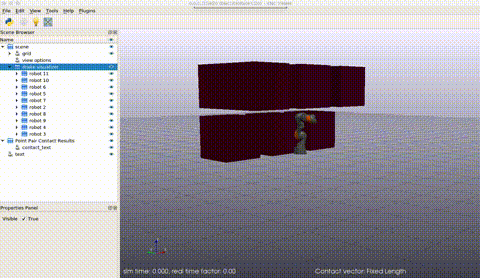

A Simple Example using OMPL and Drake in a CMake project
## Instructions
Build as a standard CMake project, assuming that you have `drake` installed where it can be found (e.g. `/opt/drake`) and `OMPL` installed per their instructions (e.g. `/usr/local/include/ompl-1.5`). 
```bash
cd <install_location>
mkdir -p build
cd build
cmake ..
make
```
To run the project and see the output, first start up a `drake-visualizer` (located in `/opt/drake/bin/drake-visualizer`). If running inside a docker, use `VNC` like so:
```bash
export DISPLAY=:20
Xvfb :20 -screen 0 1366x768x16 &
x11vnc -passwd TestVNC -display :20 -N -forever &
/opt/drake/bin/drake-visualizer &
```
Then run the planner:
```bash
./drake_ompl_demo
```

## Expected Output


```bash
RobotCollisionChecker: robot_dof_: 7
Debug:   RRTConnect: Planner range detected to be 2.797105
Properties of the state space 'RealVectorSpace0'
  - signature: 2 1 7
  - dimension: 7
  - extent: 13.9855
  - sanity checks for state space passed
  - probability of valid states: 0.479
  - average length of a valid motion: 1.86412
  - average number of samples drawn per second: sampleUniform()=7.56773e+06 sampleUniformNear()=8.3185e+06 sampleGaussian()=2.47829e+06
Settings for the state space 'RealVectorSpace0'
  - state validity check resolution: 1%
  - valid segment count factor: 1
  - state space:
Real vector state space 'RealVectorSpace0' of dimension 7 with bounds:
  - min: -2.96706 -2.0944 -2.96706 -2.0944 -2.96706 -2.0944 -3.05433
  - max: 2.96706 2.0944 2.96706 2.0944 2.96706 2.0944 3.05433

Declared parameters:
longest_valid_segment_fraction = 0.01
projection.cellsize.0 = 0.0834217
projection.cellsize.1 = 0.0782829
projection.cellsize_factor = 0
valid_segment_count_factor = 1
Valid state sampler named uniform with parameters:
nr_attempts = 100
Planner RRTConnect specs:
Multithreaded:                 No
Reports approximate solutions: No
Can optimize solutions:        No
Aware of the following parameters: intermediate_states range
Declared parameters for planner RRTConnect:
intermediate_states = 0
range = 2.7971
Start states:
RealVectorState [0.391309 1.19062 0.891649 -0.863306 0.694499 0.512097 0]
Goal state, threshold = 2.22045e-16, memory address = 0x55bc15ac67c0, state =
RealVectorState [-0.391345 -1.19056 -0.891491 0.863343 -0.694777 -0.512052 0]
OptimizationObjective = nullptr
There are 0 solutions
Info:    RRTConnect: Starting planning with 1 states already in datastructure
Info:    RRTConnect: Created 12 states (9 start + 3 goal)
Info:    Solution found in 0.098357 seconds
Info:    SimpleSetup: Path simplification took 0.077200 seconds and changed from 5 to 6 states
[2020-09-29 12:58:34.825] [console] [info] path length 7.195714259009568 and size 6 BEFORE interpolation
[2020-09-29 12:58:34.825] [console] [info] path length 7.195714259009563 and size 50 AFTER interpolation
```
